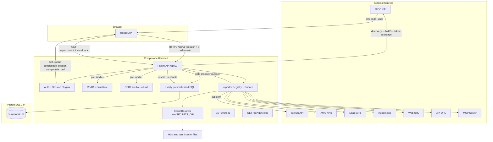
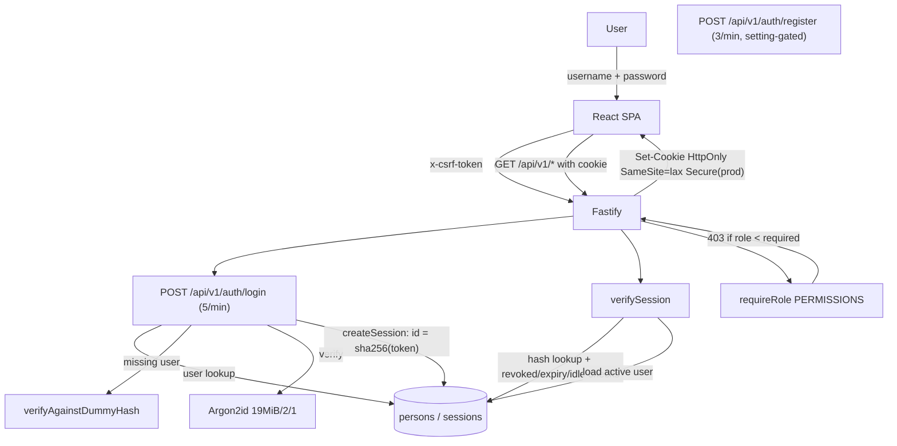
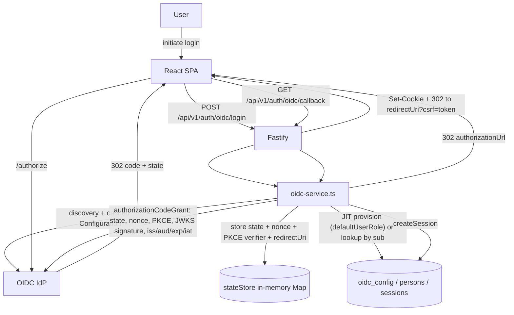
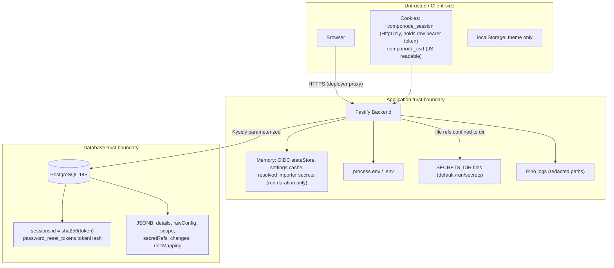
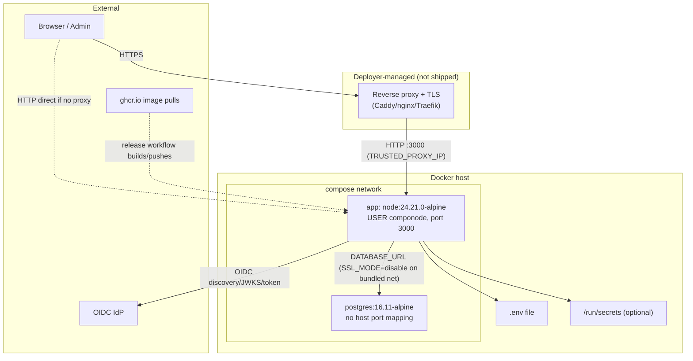

# Componode Security Assessment Report

- **Date:** 2026-09-13
- **Scope:** Architecture, data flow, authN/authZ, deployment, source code, dependencies, runtime and infrastructure components
- **Methodology:** Read-only review of docs, ADRs, source code, and dependency audit. Re-assessment three days after `docs/security/2026-09-10-security-assessment-2.md` to verify the `010-security-hardening` fixes (ADR-106) and to catch residual or new issues.
- **Limitations:** No dynamic testing, no access to running environment

---

## 1. Executive Summary

Componode is an open-source, self-hosted Digital Product Asset Management (DPAM) tool: a pnpm monorepo with a Fastify/Kysely/PostgreSQL backend on **Node.js 24**, a React/Vite frontend, and seven in-tree importers. This assessment confirms that **every Critical, High, and Medium finding from the 2026-09-10 report has been remediated** by spec `010-security-hardening` (all 47 tasks complete, ADR-106 ratified):

- The OIDC callback now verifies the ID token via `openid-client` discovery + `authorizationCodeGrant` with `expectedState`, `expectedNonce`, `pkceCodeVerifier`, `idTokenExpected: true`, and `enableNonRepudiationChecks` (JWKS signature, issuer, audience, `exp`/`iat`, `sub`, nonce all validated). The unverified `decodeJwtPayload` path is gone (`packages/backend/src/services/oidc-service.ts:113-151`).
- `pnpm audit --prod` dropped from **18 findings (12 high)** to **1 moderate** (`uuid@8.3.2` via `node-cron`, a code path not exercised).
- Runtime floor is now Node 24 LTS (`node:24.21.0-alpine`, `.nvmrc`, `engines >=24`, CI reads `.nvmrc`) and PostgreSQL 14+ is enforced by a startup preflight that also ensures `pgcrypto`.
- Session bearer tokens are stored SHA-256 hashed at rest (migration `009` revokes pre-existing sessions); session revocation enforces owner-or-ADMIN; `trustProxy` defaults to `false` and honors `X-Forwarded-*` only via `TRUSTED_PROXY_IP`; `secretRefs` are masked to key-only in API responses; `file:` secrets are confined to `SECRETS_DIR`; the web-url/api-url importers enforce a private-address URL allowlist; self-registration can no longer provision ADMIN; `DATABASE_SSL_MODE` defaults to `require` in production; login performs dummy-hash timing equalization; password minimum is 12 on all set paths; CI runs `pnpm audit --prod --audit-level=high`.

**No Critical or High findings remain.** The residual risk is concentrated in four Medium items:

1. **OIDC `redirect_uri` is not validated.** `POST /auth/oidc/login` stores a caller-supplied `redirect_uri` and the callback 302s to `${redirectUri}?csrf=<token>` — an open redirect that also places a live CSRF token in the URL of an arbitrary external origin and enables login-CSRF (victim lands on an attacker-controlled URL holding a session for the attacker's account).
2. **Release and docs pipelines still run on Node 20** (EOL since 2026-04-30), contradicting `engines >=24` — the job that builds and publishes the production image runs on an unsupported runtime.
3. **ADR-097 per-route rate limits are incomplete** — no dedicated limit on the OIDC login/callback endpoints or importer trigger, and rate limiting is effectively per-IP (not per-user) because it runs before `verifySession`.
4. **The in-memory OIDC `stateStore` has no expiry or bound**, allowing slow memory growth via the public login-initiation endpoint.

Low findings cover documentation drift (`CSRF_SECRET`, `OIDC_*` env vars documented but never read; missing Caddy/nginx TLS docs promised by ADR-093), HSTS flags that contradict ADR-089, a CSP-blocked inline theme script, an unreachable OIDC button in the frontend (wrong status path + GET link to a POST-only route), unused OIDC `roleMapping` fields (ADR-074 gap), an unvalidated `POST /auth/password/reset` body, single-stage Dockerfile, weak bundled DB defaults, floating CI action tags, `^` semver ranges, and unauthenticated `/metrics`/`/health` information disclosure.

This report includes Mermaid diagrams for the end-to-end data flow, AuthN/AuthZ flow, data storage and trust boundaries, and deployment architecture, and concludes with a reproducible methodology and follow-on report types.

---

## 2. Scope and Methodology

### 2.1 Scope

- **Governance:** `AGENTS.md`, `.specify/memory/constitution.md`, `researches/architecture-decisions.md`, `researches/adrs/ADR-084-*.md` through `ADR-106-*.md`, `specs/010-security-hardening/*`, and the prior report `docs/security/2026-09-10-security-assessment-2.md`.
- **Deployment and runtime:** `docs/deployment.md`, `docker-compose.yml`, `Dockerfile`, `.env.example`, `.dockerignore`, `init-db.sql`, `.nvmrc`, root and workspace `package.json` (`engines`, `packageManager`, `pnpm.overrides`), `.github/workflows/{ci,release,docs}.yml`, `scripts/`.
- **Backend:** `packages/backend/src/app.ts`, `server.ts`, all plugins, routes, services, `db/connection.ts`, `db/platform-check.ts`, and migrations `001`–`009`.
- **Frontend:** `packages/frontend/index.html`, `src/api/client.ts`, `src/pages/login.tsx`, `src/pages/oidc-callback.tsx`, `src/pages/settings.tsx`, `src/components/safe-url.ts`.
- **Core:** `packages/core/src/schemas/`, `src/validation/` (incl. `url-safety.ts`), `src/constants/passwords.ts`.
- **Importers:** all `packages/importer-*/src/` packages.
- **Dependencies and runtime supply chain:** `pnpm-lock.yaml`, `pnpm audit --prod`, `node --version`, `pnpm --version`.

### 2.2 Methodology

1. Read the constitution, ADR index, and all security ADRs (084–106), including the 2026-09-10 amendments.
2. Verified each prior finding against current code; regression tests exist under `packages/backend/test/` (`trust-proxy.test.ts`, `secret-resolver.test.ts`, `oidc.test.ts`, etc.).
3. Traced the AuthN/AuthZ path (login, session hash lookup, OIDC code flow, RBAC, CSRF).
4. Examined storage, migrations, audit triggers, and secret resolution.
5. Reviewed deployment artifacts and runtime evidence (Node 24 image pin, Postgres 16.11 pin, CI definitions).
6. Ran `pnpm audit --prod` (Node v24.8.0, pnpm 9.15.2).
7. Grep-scanned for `sql.raw`/`sql.fragment`, `dangerouslySetInnerHTML`, `eval`, `new Function`, and route-level `preHandler` coverage.

---

## 3. Architecture and Data-Flow Summary

### 3.1 High-Level Architecture

| Layer | Technology | Security Boundary |
|---|---|---|
| Frontend SPA | React 18 + Vite + TanStack Query + React Router + Tailwind + shadcn/ui | Same-origin in production (served by `@fastify/static` 10.1.3); no `dangerouslySetInnerHTML`; `safeUrl()` filters external links |
| Backend API | TypeScript + Fastify 5.12.4 + Kysely 0.29.5 | `/api/v1` prefix; every route authenticated except public auth routes, `/api/v1/health`, `/metrics`; Zod validation at boundaries |
| Database | PostgreSQL >=14 (Compose pins `postgres:16.11-alpine`) | CHECK constraints from `core` constants; append-only audit tables; least-privilege `componode` user; `pgcrypto` enforced at startup |
| Migrations | Kysely built-in, TypeScript (`001`–`009`) | Run at startup after `assertDatabasePlatform()` preflight |
| Importers | 7 in-tree packages, pull-only `AsyncGenerator<DiscoveredAsset>` | No DB access; secrets resolved by backend `SecretResolver` (env or `SECRETS_DIR`-confined files); ESLint-sandboxed; URL allowlist for web/api importers |
| Auth | Local (Argon2id) + optional OIDC (`openid-client` 6.8.5) | Server-side PostgreSQL sessions; 256-bit tokens stored SHA-256 hashed; RBAC (`VIEWER`/`EDITOR`/`ADMIN`) |
| Observability | Pino + Prometheus + OpenTelemetry | Pino redaction incl. `secretRefs`, `oidcSubject`, `email`; `/metrics` unauthenticated (network restriction expected) |
| Deployment | Docker Compose (one app container) | Backend serves static frontend; TLS termination delegated to deployer's reverse proxy |
| Runtime | Node.js 24 (`node:24.21.0-alpine`, patch-pinned) | `.nvmrc` = 24; `engines.node >=24.0.0` |
| Package manager | pnpm 9.15.2 (Corepack) | Lock file exact; `pnpm.overrides` pin `fast-uri` to 3.1.7 / 4.1.4; `package.json` still uses `^` ranges |
| CI/CD | GitHub Actions (`ubuntu-latest`, floating `actions/*@vN`) | Lint, typecheck, test, build, `pnpm audit --prod`, docs build; release/docs workflows still run Node 20 |

### 3.2 End-to-End Data Flow



### 3.3 Notable Flow Behaviors

- The frontend reads `componode_csrf` from `document.cookie` and sends it as `x-csrf-token` on state-changing requests (`packages/frontend/src/api/client.ts:3-31`); the backend issues the cookie on safe requests when absent (`packages/backend/src/plugins/csrf.ts:40-48`).
- Sessions are looked up by `sha256(cookie)`; plaintext tokens never reach the database (`packages/backend/src/plugins/session.ts:30-42`, `packages/backend/src/services/session-service.ts:13-29`).
- Importers are pull-only and validated by `validateDiscoveredAssetDetailed` per yielded asset; the core owns upsert/reconciliation (`packages/backend/src/services/import-run-service.ts:450-482`).
- Only `web-url` and `api-url` perform outbound `fetch` of operator-supplied URLs, and both schemas apply `urlSafetyError` `.superRefine` (blocks loopback/RFC-1918/link-local/CGNAT/multicast/reserved IPv4, IPv6 loopback/ULA/link-local/multicast incl. IPv4-mapped, `localhost`, `.local`, non-http(s) schemes). The AWS/Azure/Kubernetes/MCP importers are currently stubs that emit synthetic assets without network calls; the GitHub importer calls only `api.github.com` via Octokit.

---

## 4. AuthN/AuthZ Deep-Dive

### 4.1 Local Authentication + Session + RBAC Flow



### 4.2 OIDC Authentication Flow (post-hardening)



### 4.3 Key AuthN/AuthZ Observations

- **Password hashing:** Argon2id, 19 MiB memory, 2 iterations, parallelism 1 (`packages/backend/src/utils/argon2.ts:6-11`). Dummy-hash verification equalizes timing for missing/inactive/password-less users (`argon2.ts:28-35`, `auth-service.ts:32-38`).
- **Session tokens:** 32-byte `crypto.randomBytes` base64url; `sessions.id` stores `sha256(token)`; non-secret `publicId` + `tokenLast4` for display (`utils/crypto.ts:7-25`, `session-service.ts:16-27`). Migration `009` revoked all legacy plaintext sessions.
- **Session checks:** revoked → 401, `expiresAt` → 401, idle timeout from `sessionIdleTimeoutMs` (default 4h) → 401, inactive user → 401 (`plugins/session.ts:44-81`).
- **Session revocation:** by `publicId`; `403` unless `caller.role === 'ADMIN'` or `session.userId === caller.id`; audited (`session-service.ts:39-72`).
- **Session cookie:** `HttpOnly`, `SameSite=lax`, `Secure` in production (`routes/auth.ts:15-20`). Cookies are *not* marked `signed: true`, though `COOKIE_SECRET` is registered with `@fastify/cookie` (`app.ts:59-61`).
- **CSRF:** double-submit `componode_csrf` cookie vs `x-csrf-token` header for POST/PUT/PATCH/DELETE (`plugins/csrf.ts:24-36`). Token is an unsigned `randomBytes(32)`; `CSRF_SECRET` is documented but never read by code.
- **RBAC:** `PERMISSIONS` matrix + role levels (`plugins/rbac.ts:6-54`). `hasPermission` returns `true` for unmapped actions — enforcement relies on every mutation route explicitly using `requireRole` (verified across all 66 route registrations; a backend contract test enforces OpenAPI/`x-permission`/`requireRole` parity per ADR-104).
- **OIDC:** full verification as described in §4.2; state store is in-memory (single-instance), keyed by `state`, deleted on callback. JIT users get `defaultUserRole`; the stored `roleClaimPath`/`claimValueField`/`roleMapping` fields are **not consulted** by `handleCallback` (see Finding 8.4.6).
- **Rate limits:** global 300/min; login 5/min; register 3/min. Missing dedicated limits for OIDC login/callback and importer trigger (see Finding 8.3.3).
- **Route audit:** the only unauthenticated routes are `POST /auth/login`, `POST /auth/logout`, `POST /auth/password/reset/confirm`, `POST /auth/register`, `GET/POST /auth/oidc/*`, `GET /api/v1/health`, `GET /metrics`. All other routes use `verifySession`; all mutations use `requireRole`.

---

## 5. Data Storage and Integrity

### 5.1 Database Tables (unchanged since prior report)

| Group | Tables | Purpose |
|---|---|---|
| Org | `line_of_businesses`, `teams`, `persons` | Org structure, users, roles |
| Auth | `sessions`, `password_reset_tokens`, `oidc_config` | Hashed sessions/resets, IdP config |
| Config | `app_settings`, `importer_configs` | Runtime settings, importer configs (`secretRefs`) |
| Catalog | `digital_products`, `component_groups`, `components`, `component_instances` | Product/component catalog |
| Graph | `product_composes`, `product_consumes_from`, `product_depends_on_component`, `component_depends_on_component`, `component_sources_from`, `component_exposes` | Typed many-to-many edges |
| Import | `import_runs`, `import_run_errors` | Run state, per-asset errors |
| Audit | `entity_changes`, `edge_changes` | Append-only change log |

### 5.2 Data Storage and Trust Boundaries



### 5.3 Data Integrity Controls

- **Append-only audit tables:** `entity_changes`, `edge_changes`, `import_run_errors` reject UPDATE/DELETE via triggers (migration `002`).
- **Terminal-state immutability:** `import_runs` terminal rows cannot be updated (migration `003`).
- **CHECK constraints** generated from `core` constants; no native ENUMs (migration `001`, `db/check-constraint-helper.ts` — `sql.raw` used only inside migrations, per ADR-084 allowance).
- **Hashed credentials at rest:** `sessions.id = sha256(token)` (migration `009`); `password_reset_tokens.tokenHash` with 15-min expiry and single-use `usedAt` (`services/password-reset-service.ts`).
- **Secret handling:** `secretRefs` masked to `{key}` in all importer-config responses and audit changes (`services/importer-config-service.ts:40-51`); OIDC `clientSecretRef` masked in audit (`settings-service.ts:205-208`); `file:` refs confined to `SECRETS_DIR` with traversal rejection (`utils/secret-resolver.ts:17-33`); Pino redaction covers `secretRefs`, `secrets.*`, `oidcSubject`, `email`, etc. (`plugins/logging.ts:6-25`).
- **Platform preflight:** `assertDatabasePlatform()` enforces `server_version_num >= 140000` and ensures `pgcrypto` before migrations (`db/platform-check.ts`, `server.ts:52`).

---

## 6. Deployment and Operational Security

### 6.1 Deployment Architecture



### 6.2 Deployment Artifacts

| Artifact | Key Facts | Security Note |
|---|---|---|
| `docker-compose.yml` | `postgres:16.11-alpine` (minor-pinned, no host port), `app` maps `${PORT:-3000}:3000`, healthchecks on both services | App exposed directly on host; no shipped reverse proxy; Postgres not reachable off-container |
| `Dockerfile` | Single-stage `node:24.21.0-alpine` (patch-pinned), `pnpm install --frozen-lockfile` + `pnpm build`, then `USER componode` | Dev dependencies and full build toolchain remain in the final image; build runs as root |
| `init-db.sql` | `componode` role + DB, `\connect componode` + `CREATE EXTENSION IF NOT EXISTS pgcrypto` | Hardcoded `componode_pw`; Compose Postgres superuser password `postgres` |
| `.env.example` | `DATABASE_SSL_MODE=disable` explicitly (bundled PG has no TLS), documents `TRUSTED_PROXY_IP`, `SECRETS_DIR`, `COOKIE_SECRET` | Still documents `CSRF_SECRET` and `OIDC_*` vars the code never reads; `BOOTSTRAP_ADMIN_PASSWORD=ChangeMe123!` default |
| `docs/deployment.md` | Documents DB requirements (PG 14+, pgcrypto), env table, upgrade path | No Caddy/nginx TLS-termination docs and no commented-out Caddy service, despite ADR-093 promising both |
| `.dockerignore` | Excludes `.env*`, `.git`, `node_modules`, `researches`, `specs` | `.env` cannot leak into the build context |
| `.gitignore` | Excludes `.env`, `.env.local`, `.env.*.local`, `*.pem`, `*.key` | `.env` present locally but untracked |

### 6.3 Runtime Startup (`server.ts`)

1. `assertDatabasePlatform()` — PG >= 14 + `pgcrypto` (auto-creates when permitted).
2. Kysely `migrateToLatest()` (file provider, `001`–`009`).
3. `recoverRuns()` — marks stale runs interrupted.
4. `bootstrapAdmin()` — creates admin only on empty `persons`; **fails startup** if DB is empty and `BOOTSTRAP_ADMIN_*` unset.
5. `initScheduler()` — `node-cron` for enabled configs.
6. `buildApp()` + listen on `0.0.0.0:${PORT}`.

### 6.4 Unauthenticated Endpoints

- `GET /api/v1/health` — status, database, uptime, version (`routes/health.ts`).
- `GET /metrics` — full Prometheus exposition (`routes/metrics.ts`).
- `GET /auth/oidc/status` — `{enabled}` flag for the login page.
- `POST /auth/login`, `POST /auth/logout`, `POST /auth/register`, `POST /auth/password/reset/confirm`, `POST /auth/oidc/login`, `GET /auth/oidc/callback` — public by design, all behind CSRF for state-changing methods and global/login-specific rate limits.

### 6.5 Runtime and Infrastructure Components

| Component | Version / Source | Security Note |
|---|---|---|
| Node.js | `node:24.21.0-alpine` (`Dockerfile:5`); `engines >=24.0.0`; `.nvmrc` = 24; local toolchain v24.8.0 | **Compliant.** Node 24 is the active LTS (support to 2028-04). Image pinned to a patch tag but not to a digest. |
| pnpm | `pnpm@9.15.2` via `corepack enable pnpm` | Version recorded; Corepack fetch at build time remains a supply-chain hop. |
| Alpine OS | `node:24.21.0-alpine` + `apk add wget` | OS packages unpinned/unscanned; no image scanning in CI. |
| PostgreSQL | `postgres:16.11-alpine` (Compose + testcontainers); `pg@8.23.0` driver; `kysely@0.29.5` | PG 16 supported until 2028-11. Startup enforces >=14 and `pgcrypto`. Tag pinned to minor, not digest. `DATABASE_URL` can still point at an external EOL >=14 instance (14 EOLs 2026-11-12) — preflight enforces the floor but not an upper bound or patch level. |
| GitHub Actions | `ubuntu-latest`; `actions/checkout@v4`, `pnpm/action-setup@v4`, `actions/setup-node@v4`, `docker/*@v3`, `build-push-action@v5` | Floating runner + action tags (not SHA-pinned). **`release.yml` and `docs.yml` still use `node-version: 20`** — see Finding 8.3.2. |
| CI audit | `pnpm audit --prod --audit-level=high` in `ci.yml:28-29` | Now enforced; `--prod` excludes devDependency advisories. |

---

## 7. Security Controls (Strengths)

| Control | Evidence |
|---|---|
| OIDC ID-token verification (JWKS, iss/aud/exp/iat/nonce, PKCE, discovery) | `services/oidc-service.ts:47-56, 74-91, 113-151` |
| Argon2id password hashing + dummy-hash timing equalization | `utils/argon2.ts:6-35` |
| Session tokens: 256-bit random, SHA-256 at rest, `publicId`/`tokenLast4` display split | `utils/crypto.ts`, `services/session-service.ts`, migration `009` |
| Session revocation owner-or-ADMIN + audit event | `services/session-service.ts:39-72` |
| Idle + absolute session timeouts | `plugins/session.ts:58-64`, `settings-service.ts:7-8` |
| CSRF double-submit on all state-changing methods | `plugins/csrf.ts` |
| `trustProxy` default `false`, `TRUSTED_PROXY_IP` allowlist | `app.ts:39-47`, `test/unit/trust-proxy.test.ts` |
| CORS opt-in, exact origins, no wildcards | `plugins/cors.ts` |
| Security headers incl. CSP, frame-deny, nosniff, referrer policy | `plugins/helmet.ts` |
| 1 MB body limit; RFC 7807 errors; no stack traces unless `DEBUG_ERROR_DETAILS` | `app.ts:55`, `plugins/error-handler.ts` |
| Zod at route boundaries; route coverage verified (all mutations `requireRole`) | `packages/core/src/schemas/`, `routes/*.ts` |
| No `sql.raw`/`sql.fragment` outside migration helpers; no `dangerouslySetInnerHTML`/`eval`/`new Function` anywhere | grep-verified |
| `SECRETS_DIR` confinement for file secrets | `utils/secret-resolver.ts:17-33` |
| `secretRefs` key-only masking in API + audit | `services/importer-config-service.ts:40-51` |
| Importer URL allowlist (SSRF guard) incl. IPv6 and IPv4-mapped forms | `core/src/validation/url-safety.ts`, importer config schemas |
| Importer ESLint sandbox (no `fs`/`child_process`/`process`/`eval`, no cross-imports) | `eslint.config.js:20-52` |
| Append-only audit + terminal-state triggers | migrations `002`, `003` |
| DB platform preflight (PG >= 14 + `pgcrypto`) | `db/platform-check.ts`, `server.ts:52` |
| `DATABASE_SSL_MODE=require` default in production; `verify-full` + CA support | `db/connection.ts:26-47` |
| Self-registration/ADMIN invariant (merged-state reject + defensive clamp) | `settings-service.ts:83-100`, `routes/auth.ts:161-167` |
| `pnpm audit --prod --audit-level=high` in CI | `.github/workflows/ci.yml:28-29` |
| `pnpm.overrides` pinning `fast-uri` to patched versions | `package.json:36-41` |

---

## 8. Findings

### 8.1 Critical

None.

### 8.2 High

None.

### 8.3 Medium

#### 8.3.1 OIDC `redirect_uri` is unvalidated — open redirect + CSRF token in URL + login CSRF

- **Location:** `packages/backend/src/routes/auth.ts:210-244`; `packages/backend/src/services/oidc-service.ts:58-92, 219`
- **Description:** `POST /auth/oidc/login` accepts `?redirect_uri=` and stores it verbatim in `stateStore`. After a successful code exchange, the callback responds `302` to `` `${redirectUri}?csrf=${csrfToken}` ``. Nothing constrains `redirect_uri` to the application origin or a path prefix. Consequences: (a) **open redirect** — an attacker-controlled absolute URL receives the browser after login; (b) **CSRF token disclosure** — the freshly-minted `componode_csrf` value is placed in the target URL, so an external origin learns the token matching the cookie just set (impact is limited by `SameSite=lax`, which prevents cross-site requests from carrying the session cookie, but the token also lands in browser history, proxy logs, and `Referer` headers); (c) **login CSRF** — an attacker can initiate the flow with their own credentials and a `redirect_uri` under their control, have the IdP redirect a victim through the callback, and leave the victim authenticated as the attacker's account.
- **Recommendation:** Reject `redirect_uri` values that are not same-origin relative paths (e.g., require the value to start with `/` and not `//`), or validate against an allowlist of configured origins. Do not transport the CSRF token in the URL — the callback's `Set-Cookie` already carries it and the SPA reads it from `document.cookie` (the `?csrf=` param appears unused by `oidc-callback.tsx`, which just navigates to `/`).

#### 8.3.2 Release and docs pipelines still run on Node 20 (EOL)

- **Location:** `.github/workflows/release.yml:43,119`; `.github/workflows/docs.yml:31`
- **Description:** `ci.yml` was migrated to `node-version-file: .nvmrc` (24), but `release.yml` (`version` and `publish` jobs) and `docs.yml` still set `node-version: 20`. Node 20 reached EOL on 2026-04-30. The `publish` job runs `pnpm install`/`pnpm build` and builds the production image on an EOL runtime, and `engines.node >=24.0.0` makes the install/runtime behavior inconsistent with the declared floor.
- **Recommendation:** Switch both workflows to `node-version-file: .nvmrc` (or `node-version: 24`).

#### 8.3.3 ADR-097 per-route rate limits incomplete; effective keying is per-IP

- **Location:** `packages/backend/src/plugins/rate-limit.ts:4-21`; `packages/backend/src/routes/auth.ts` (no limit config on `/auth/oidc/login`, `/auth/oidc/callback`); `packages/backend/src/routes/importers.ts:110-124` (no limit on trigger)
- **Description:** ADR-097 specifies OIDC callback at 5/IP/min and importer trigger at 10/user/min. Neither route sets `config.rateLimit`, so they fall back to the global 300/min. Additionally, `@fastify/rate-limit` runs at `onRequest` — before `verifySession` populates `req.user` — so `keyGenerator` always falls through to `req.ip`; the documented "per-user" general limit is effectively per-IP (correct only because `trustProxy` now defaults to `false`).
- **Recommendation:** Add `config.rateLimit` entries for `/auth/oidc/login`, `/auth/oidc/callback`, `/auth/password/reset/confirm`, and `/importer-configs/:id/trigger` per ADR-097; either move the rate-limit hook after session verification or amend ADR-097 to document per-IP keying for unauthenticated requests.

#### 8.3.4 OIDC `stateStore` is unbounded and never expires

- **Location:** `packages/backend/src/services/oidc-service.ts:17, 79, 104-111`
- **Description:** Every `POST /auth/oidc/login` inserts `{redirectUri, pkceVerifier, nonce}` into a module-level `Map` keyed by `state`. Entries are deleted only on a successful callback; abandoned flows accumulate forever. The endpoint is public (global 300/min applies), so a remote caller can grow process memory indefinitely (≈430k entries/day at the limit) until restart.
- **Recommendation:** Store `{createdAt}` and sweep/expire entries older than the OIDC flow TTL (e.g., 10 min), and/or cap the map size.

#### 8.3.5 SSRF residual: DNS rebinding and unguarded `endpoint` fields

- **Location:** `packages/core/src/validation/url-safety.ts` (guard is as-written); `packages/importer-mcp-server/src/config.ts:5`, `packages/importer-kubernetes/src/config.ts:6`, `packages/importer-aws/src/config.ts`, `packages/importer-azure/src/config.ts` (optional `endpoint` fields lack `.superRefine`)
- **Description:** ADR-106 documents the DNS-rebinding residual for `web-url`/`api-url`. Additionally, four other importer schemas accept optional `endpoint`/`baseUrl`-style URLs without the allowlist. Today those fields are inert (the importers never fetch them), but when the stub importers gain real network calls the guard will be absent unless schemas are updated.
- **Recommendation:** Apply `urlSafetyError` `.superRefine` (or an explicit allowlist for providers that legitimately target private clusters, e.g., Kubernetes API servers) to every URL-bearing importer config field now, so the protection predates the network calls; document container-egress restriction in `docs/deployment.md`.

### 8.4 Low

#### 8.4.1 `CSRF_SECRET` and `OIDC_*` env vars are documented but never read

- **Location:** `.env.example:30-31,39-41`; `docs/deployment.md:86-90`; code grep confirms no `process.env.CSRF_SECRET` / `process.env.OIDC_*` reads
- **Description:** Deployers are told to set `CSRF_SECRET` (marked required) and optional `OIDC_ISSUER`/`OIDC_CLIENT_ID`/`OIDC_CLIENT_SECRET`, but the CSRF token is an unsigned `randomBytes(32)` cookie and OIDC config comes exclusively from the `oidc_config` table. The unsigned double-submit cookie itself is acceptable, but the docs imply an HMAC that does not exist. (Persisted from prior findings 8.4.1/8.4.2.)
- **Recommendation:** Remove the dead variables from `.env.example`/`deployment.md`, or implement their documented behavior.

#### 8.4.2 HSTS `includeSubDomains` + `preload` contradict ADR-089

- **Location:** `packages/backend/src/plugins/helmet.ts:24-26`
- **Description:** ADR-089 deliberately omits `includeSubDomains` to avoid breaking non-HTTPS subdomains; the implementation sets both it and `preload`. (Persisted from prior finding 8.4.7.)
- **Recommendation:** Drop the two flags or amend ADR-089.

#### 8.4.3 CSP `script-src 'self'` blocks the inline theme script

- **Location:** `packages/frontend/index.html:7-19`; `plugins/helmet.ts:11`
- **Description:** The pre-paint dark-mode script in `index.html` is blocked by CSP (no nonce/`'unsafe-inline'` for scripts). Functional defect; proves CSP enforcement. (Persisted from prior finding 8.4.4.)
- **Recommendation:** Move the snippet into the bundle or add a CSP nonce/hash.

#### 8.4.4 OIDC login is unreachable from the frontend

- **Location:** `packages/frontend/src/pages/login.tsx:18,106`; `packages/backend/src/routes/auth.ts:204,210`
- **Description:** Two mismatches break the flow: (a) the status probe calls `GET /api/v1/settings/oidc/status`, but the public route is `GET /api/v1/auth/oidc/status` — `/settings/oidc/status` does not exist, the fetch 404s, and `oidcEnabled` stays `false` so the button never renders; (b) the button is `<a href="/api/v1/auth/oidc/login">` (a GET navigation) while the route is POST-only — even if rendered, the click yields a 404 problem response. Security-relevant because the hardened OIDC path currently cannot be exercised end-to-end through the UI.
- **Recommendation:** Point the probe at `/auth/oidc/status` and trigger the POST via `apiFetch` (which attaches `x-csrf-token`) followed by `window.location.assign()` of the returned/redirected URL.

#### 8.4.5 `POST /auth/password/reset` body is not schema-validated

- **Location:** `packages/backend/src/routes/auth.ts:105-115`
- **Description:** Body is cast to `{userId?: string}` and only checked for presence; `passwordResetRequestSchema` (`userId` as `uuid`) exists but is unused. A non-UUID `userId` reaches the DB insert and produces a 500 instead of a 400. (Persisted from prior finding 8.4.3; admin-only endpoint, low impact.)
- **Recommendation:** Apply `passwordResetRequestSchema.safeParse`.

#### 8.4.6 OIDC `roleMapping`/`roleClaimPath`/`claimValueField` are stored but unused

- **Location:** `packages/core/src/schemas/settings.ts:26-28`; `settings-service.ts:193-203`; `services/oidc-service.ts:153-203`
- **Description:** The admin UI and schema accept ADR-074 claim-to-role mapping fields, but `handleCallback` never reads them — JIT users always receive `defaultUserRole` and existing users' roles never change on re-login. It fails closed (no elevation), but is a documented-capability gap: an operator who configures `roleMapping` expecting IdP-driven admin provisioning gets `VIEWER`/`EDITOR` users instead, and role *revocation* at the IdP never propagates.
- **Recommendation:** Implement the mapping per ADR-074 or remove the fields from schema/UI until implemented.

#### 8.4.7 `GET /auth/oidc/callback` performs state-changing side effects

- **Location:** `packages/backend/src/routes/auth.ts:226-255`
- **Description:** The callback creates users and sessions on a GET — inherent to OIDC, but ADR-094 does not record the exception. Risk is bounded by `state`+nonce+PKCE, yet the unvalidated `redirect_uri` (8.3.1) weakens the binding. (Persisted from prior finding 8.4.5.)
- **Recommendation:** Record the OIDC callback as a documented exception in ADR-094; fix 8.3.1.

#### 8.4.8 Single-stage Dockerfile ships dev dependencies and builds as root

- **Location:** `Dockerfile:5-26`
- **Description:** `pnpm install --frozen-lockfile` installs dev deps (vite, vitest, testcontainers, eslint…) and `pnpm build` runs as root before `USER componode`. The final image carries the full build toolchain and devDependency attack surface (which `pnpm audit --prod` does not cover). (Persisted from prior finding 8.4.8.)
- **Recommendation:** Multi-stage build; final stage with `pnpm install --prod` and only `dist` artifacts.

#### 8.4.9 Weak default database credentials in Compose/init-db

- **Location:** `docker-compose.yml:7-8`; `init-db.sql:5`; `.env.example:9`
- **Description:** Postgres superuser password `postgres` and app password `componode_pw`. Mitigated by the DB having no host port mapping, but any lateral access to the compose network reaches a trivially-guessable DB. (Persisted from prior finding 8.4.9.)
- **Recommendation:** Parameterize credentials via `.env` and generate random values at first boot or document mandatory replacement.

#### 8.4.10 Unauthenticated `/metrics` and `/api/v1/health` disclose internals

- **Location:** `routes/metrics.ts:7-10`; `routes/health.ts:16-21`
- **Description:** Full metric names/labels and app version/uptime are public on port 3000, which the default Compose maps to the host. Intentional per ADR-069/097 but relies on deployer network policy. (Persisted from prior finding 8.4.10.)
- **Recommendation:** Document the required network restriction prominently, or add an optional `METRICS_ALLOWED_IPS` allowlist.

#### 8.4.11 Floating CI action tags and `^` semver ranges

- **Location:** `.github/workflows/*.yml`; all `package.json` files
- **Description:** Actions are tag-pinned (`@v4`, `@v5`), not SHA-pinned; runner is `ubuntu-latest`. `package.json` dependencies use `^` ranges — the lockfile pins exact versions, but a non-frozen install can drift. `pnpm audit --prod` now runs in CI (ADR-092 partially satisfied; `--prod` excludes dev deps). (Persisted from prior findings 8.4.6/8.4.11.)
- **Recommendation:** Pin actions to SHAs (e.g., via Dependabot/renovate + `dependency-review-action`); consider exact pins or a CI check on ranges.

#### 8.4.12 ADR-093 promised artifacts are missing

- **Location:** `docs/deployment.md` (no TLS section); `docker-compose.yml` (no commented Caddy service)
- **Description:** ADR-093 states `docs/deployment.md` documents TLS setup for Caddy and nginx and that `docker-compose.yml` includes a commented-out Caddy service. Neither exists; deployers get no in-repo guidance for the required TLS termination.
- **Recommendation:** Add the Caddy/nginx TLS section and the commented-out service, or amend the ADR.

#### 8.4.13 `hasPermission` default-allows unmapped actions

- **Location:** `packages/backend/src/plugins/rbac.ts:51-55`
- **Description:** An action string absent from `PERMISSIONS` returns `true` for any authenticated user. All current mutations map correctly and the ADR-104 contract test checks `x-permission`/`requireRole` parity, but a future route protected by a misspelled/new action name would silently allow VIEWERs.
- **Recommendation:** Change the default to deny and explicitly map viewer-safe actions, or fail closed with a warning log for unmapped actions.

#### 8.4.14 GitHub importer bypasses schema validation at run time

- **Location:** `packages/importer-github/src/importer.ts:106`
- **Description:** `const parsed = config as GithubConfig;` casts instead of `githubConfigSchema.parse(config)` — inconsistent with sibling importers that parse at run time (defense-in-depth the URL allowlist relies on). Scope is validated at config-save, so impact is limited to malformed stored configs reaching the importer.
- **Recommendation:** Use `githubConfigSchema.parse(config)` for parity.

#### 8.4.15 OIDC discovery fetch accepts any admin-supplied issuer and ignores issuer mismatch

- **Location:** `packages/backend/src/services/settings-service.ts:163-190`
- **Description:** `PUT /settings/oidc` triggers a server-side `fetch` to `{issuer}/.well-known/openid-configuration` — an admin-only SSRF-lite surface — and the `issuer !== discovery.issuer` branch is a deliberate no-op ("allow if the response is valid OIDC config") that validates nothing about the mismatch. Admin-authenticated, so impact is low.
- **Recommendation:** Enforce issuer equality per OIDC Discovery, or document the lenient behavior; consider applying `urlSafetyError`-style checks to the issuer URL.

---

## 9. Dependency Vulnerability Summary

`pnpm audit --prod` on 2026-09-13 (Node v24.8.0, pnpm 9.15.2): **1 finding — 0 critical, 0 high, 1 moderate.**

| Package | Installed | Severity | Advisory | Issue |
|---|---|---|---|---|
| `uuid` (via `node-cron@3.0.3`) | 8.3.2 | Moderate | GHSA-w5hq-g745-h8pq | Missing buffer bounds check in v3/v5/v6 when `buf` is provided |

`node-cron` uses `uuid` only for internal task IDs (v4), so the vulnerable `buf` path is not exercised; residual is dependency hygiene. All prior advisories resolved: `kysely@0.29.5`, `fastify@5.12.4`, `@fastify/static@10.1.3`, `fast-uri@3.1.7/4.1.4` (via `pnpm.overrides`), `openid-client@6.8.5`, `pg@8.23.0`, `zod@3.25.76`.

**Scope note:** `pnpm audit` covers packages only — not the Node runtime, Alpine OS packages, the Postgres image, or CI runner images. Container/image scanning (`trivy`, `grype`) remains absent.

---

## 10. Rules/ADR Compliance Matrix

| ADR | Title | Status | Notes |
|---|---|---|---|
| 084 | SQL injection prevention | Compliant | `sql.raw` only in `check-constraint-helper.ts` (migration-only usage). |
| 085 | XSS prevention | Compliant | No `dangerouslySetInnerHTML`; `safeUrl()`; `rel="noopener noreferrer"`. |
| 086 | Session cookie security | Mostly compliant | `HttpOnly`/`SameSite=lax`/`Secure`(prod). Cookies not `signed: true` despite `COOKIE_SECRET` being configured. |
| 087 | CSRF protection | Mostly compliant | Double-submit enforced on all mutations; token unsigned, `CSRF_SECRET` unused; token leaked via OIDC callback `?csrf=` URL (8.3.1). |
| 088 | CORS | Compliant | Opt-in exact origins; disabled by default. |
| 089 | Security headers | Mostly compliant | Helmet active; HSTS `includeSubDomains`/`preload` contradict the ADR (8.4.2); CSP blocks inline theme script (8.4.3). |
| 090 | No secrets in logs | Compliant | Redaction now includes `secretRefs`, `secrets.*`, `oidcSubject`, `email`. |
| 091 | No secrets in commits | Compliant | `.gitignore` covers `.env*`/keys; `.env` untracked; `.dockerignore` excludes `.env*`. |
| 092 | Dependency scanning | Partially compliant | `pnpm audit --prod --audit-level=high` in CI; `^` ranges remain; no image scanning; release/docs workflows not audited for Node version drift (8.3.2). |
| 093 | TLS / HTTPS | Mostly compliant | `trustProxy` fixed via `TRUSTED_PROXY_IP`; documented Caddy/nginx guidance + commented compose service missing (8.4.12). |
| 094 | GET side-effect-free | Non-compliant (documented exception needed) | OIDC callback creates sessions/users on GET (8.4.7). |
| 095 | Input validation | Mostly compliant | Zod at boundaries; `password/reset` body not schema-validated (8.4.5). |
| 096 | Error responses no leaks | Compliant | RFC 7807; stacks gated by `DEBUG_ERROR_DETAILS`. |
| 097 | Rate limiting | Partially compliant | Global + login + register limits present; OIDC and importer-trigger limits missing; effective keying is per-IP not per-user (8.3.3). |
| 098 | Importer sandboxing | Compliant | ESLint restrictions intact; secrets resolved by core only. |
| 099 | Password/credential handling | Compliant | Argon2id, min-12 on set paths, dummy-hash login, hashed session + reset tokens. |
| 100 | Audit log integrity | Compliant | Append-only + terminal-state triggers; revocations/role changes audited. |
| 101 | DB connection security | Compliant | `require` default in prod; `verify-full`+CA; platform preflight; least-privilege user (weak default passwords remain, 8.4.9). |
| 102 | JSONB content injection | Compliant | JSONB rendered as text/JSON; URLs via `safeUrl()`. |
| 104 | API documentation sync | Compliant (assumed) | Contract test enforces OpenAPI/`x-permission`/`security` parity; spec 010 regenerated docs. |
| 106 | 2026-09 hardening | Implemented | All seven decisions verified in code; DNS-rebinding residual documented (8.3.5). |

---

## 11. Prioritized Recommendations

### Immediately (before next release)

1. **Fix the OIDC redirect path (8.3.1):** restrict `redirect_uri` to same-origin relative paths and drop the `?csrf=` query parameter — the callback already sets the cookie the SPA reads.
2. **Align CI runtimes (8.3.2):** switch `release.yml` and `docs.yml` to `node-version-file: .nvmrc` so the pipeline that publishes the image runs on the supported runtime.
3. **Close the ADR-097 gaps (8.3.3):** add per-route limits for OIDC endpoints, password-reset confirm, and importer trigger.
4. **Bound the OIDC `stateStore` (8.3.4):** add entry TTL/sweep or a size cap.

### Short term

5. Apply the URL-safety `.superRefine` to the optional `endpoint` fields in the AWS/Azure/Kubernetes/MCP importer schemas (8.3.5).
6. Fix the frontend OIDC wiring (`/auth/oidc/status` path + POST initiation) so the hardened flow is actually reachable (8.4.4).
7. Remove or implement `CSRF_SECRET`/`OIDC_*` env documentation (8.4.1); drop or ratify HSTS `includeSubDomains`/`preload` (8.4.2); resolve the CSP/inline-script conflict (8.4.3).
8. Schema-validate `POST /auth/password/reset` (8.4.5); either implement or remove the unused OIDC `roleMapping` fields (8.4.6).
9. Document the ADR-094 OIDC-callback exception (8.4.7) and add the ADR-093 TLS-termination docs/commented Caddy service (8.4.12).

### Medium term

10. Multi-stage Dockerfile with `--prod` install (8.4.8); parameterize bundled DB credentials (8.4.9).
11. Pin CI actions to SHAs and the runner image; consider `dependency-review-action` (8.4.11).
12. Add container-image scanning (`trivy`/`grype`) and SBOM generation to the release pipeline.
13. Make `hasPermission` fail closed for unmapped actions (8.4.13); use `githubConfigSchema.parse` in the GitHub importer (8.4.14); enforce or document OIDC issuer equality on config save (8.4.15).

### Ongoing

14. Re-run this assessment after every dependency bump and feature merge; keep `docs/security/` reports as the review trail (prior: `2026-09-10`).

---

## 12. Reproducing This Assessment / Generating Other Reports

### Commands used

```bash
node --version            # v24.8.0
pnpm --version            # 9.15.2
pnpm audit --prod         # 1 moderate (uuid via node-cron)
# pnpm list -r --depth=0  # workspace dependency inventory
git ls-files | grep -E "^\.env"   # confirmed only .env.example tracked
# grep patterns: sql\.raw|sql\.fragment, dangerouslySetInnerHTML|eval\(|new Function,
#   app\.(get|post|patch|put|delete)\(, verifySession|requireRole|preHandler,
#   OIDC_ISSUER|CSRF_SECRET|TRUSTED_PROXY|SECRETS_DIR|PUBLIC_URL
# Optional environment checks:
# docker images | grep componode; trivy image <image>; grype <image>
# psql $DATABASE_URL -c "SHOW server_version_num; SELECT extname FROM pg_extension WHERE extname='pgcrypto';"
```

### Key files reviewed

- `AGENTS.md`, `.specify/memory/constitution.md`, `researches/architecture-decisions.md`, `researches/adrs/ADR-084`…`ADR-106`, `specs/010-security-hardening/{spec,plan,tasks}.md`
- `docs/deployment.md`, `docker-compose.yml`, `Dockerfile`, `.env.example`, `.dockerignore`, `.gitignore`, `init-db.sql`, `.nvmrc`, `.github/workflows/{ci,release,docs}.yml`
- `packages/backend/src/{app,server}.ts`, `plugins/*`, `routes/*`, `services/*`, `db/connection.ts`, `db/platform-check.ts`, `db/migrations/001`–`009`, `utils/{crypto,argon2,secret-resolver}.ts`
- `packages/frontend/index.html`, `src/api/client.ts`, `src/pages/{login,oidc-callback,settings}.tsx`, `src/components/safe-url.ts`
- `packages/core/src/schemas/*`, `src/validation/{discovered-asset,url-safety}.ts`, `src/constants/passwords.ts`
- `packages/importer-*/src/{importer,config,manifest}.ts`
- `pnpm-lock.yaml`, root + workspace `package.json` files
- Prior report: `docs/security/2026-09-10-security-assessment-2.md`

### Checklist for re-running

1. Re-read security ADRs (084–106) and any new amendments/ADRs.
2. Re-verify each finding in Section 8 against current code; confirm fixed items stay fixed via the regression tests in `packages/backend/test/`.
3. Re-run `pnpm audit --prod` and diff against Section 9.
4. Re-grep prohibited patterns (`sql.raw`, `dangerouslySetInnerHTML`, `eval`, `new Function`) and route `preHandler` coverage.
5. Diff runtime evidence: `Dockerfile` FROM tag, `.nvmrc`, `engines`, compose image tags, workflow `node-version`/action pins.
6. Check `docs/security/` for the latest prior report and verify follow-ups were implemented.

### Follow-on reports this methodology supports

- Dependency-only vulnerability report (`pnpm audit --prod` + lockfile diff)
- SAST / source-code security report (grep patterns in §12 commands)
- RBAC and authorization-matrix review (`requireRole`/`x-permission` parity vs ADR-054)
- Penetration-test checklist (OIDC redirect forgery, state-store exhaustion, rate-limit probing, SSRF against importer configs)
- Container / supply-chain hardening report (multi-stage build, digest pinning, image scanning, SBOM)
- Runtime and base-image hardening report (Node EOL tracking, OS packages, Corepack hop)
- Database platform and version risk review (PG 14–17 support window, driver/ORM drift, extension audit)
- Secrets-management and credential-rotation report (`SECRETS_DIR`, `secretRefs`, redaction coverage)
- API contract / OpenAPI drift report (ADR-104 contract test + `docs:api:check`)

---

*End of report.*
